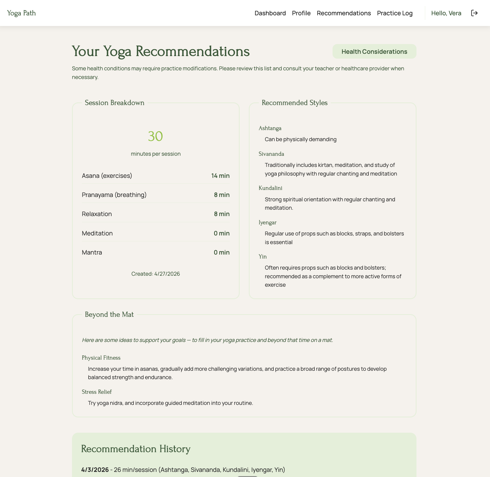

# Yoga Path — Client

A personalized yoga practice planner. Save your preferences and goals, get a session-by-session recommendation, and log every practice you finish.

<!-- Drop a screenshot at ./public/screenshot.png and uncomment the next line -->



## Features

- **Profile** — record weekly availability, session preferences (dynamic / static, structured / creative, philosophy openness), and goals.
- **Recommendations** — generates a balanced session plan (asana, pranayama, meditation, relaxation, mantra) and matches yoga styles to your profile. Regenerate whenever your profile changes.
- **Practice log** — record date, duration, and notes for each session; browse your history.
- **Limitations modal** — informational reference of common health conditions and how they intersect with practice.
- **Auth-aware UI** — the header and protected routes adapt to login state.

## Tech stack

- **React 19** + **TypeScript**
- **Vite 7** — dev server and production build
- **react-router-dom v7** — routing, with a `PrivateRoute` guard
- **react-hook-form** — form state and validation
- **axios** — shared instance with a JWT-injecting request interceptor and 401 redirect handling
- **Sass** — styles (co-located and `src/styles/`)
- **Jest** + **React Testing Library** + **ts-jest** — unit tests
- **ESLint** + **Prettier** + **lint-staged** — pre-commit toolchain
- **GitHub Actions** — CI (lint + tests on every PR)
- **Vercel** — production hosting

## Getting started

### Prerequisites

- Node.js **18, 20, or 22** (matches the CI matrix)
- A running backend — see [yoga-path-server](https://github.com/VeraV/yoga-path-server). The client defaults to `http://localhost:8080/api`.

### Install

```sh
npm install
```

### Configure (optional)

Create a `.env` file at the repo root only if your backend isn't on the default port:

```
VITE_API_URL=http://localhost:8080/api
```

### Run the dev server

```sh
npm run dev
```

Open <http://localhost:5173>.

## Scripts

| Command           | What it does                                          |
| ----------------- | ----------------------------------------------------- |
| `npm run dev`     | Vite dev server with HMR on port 5173                 |
| `npm run build`   | Type-check (`tsc -b`) and produce a production bundle |
| `npm run preview` | Preview the production build locally                  |
| `npm run lint`    | Run ESLint                                            |
| `npm test`        | Run the Jest suite                                    |
| `npm run test:ci` | Same as `npm test` plus coverage and CI flags         |

## Project structure

```
src/
├── api/              Axios instance + per-domain API functions
├── components/       layout/, guards/, common/
├── context/          AuthContext (JWT + user state)
├── pages/            Home, Login, Register, Dashboard, Profile, Recommendations, PracticeLog
├── styles/           Sass stylesheets
├── types/            TypeScript interfaces, barrel-exported from index.ts
└── jest.setup.ts     Test environment setup
```

Routing lives in `src/App.tsx`. Public routes (`/`, `/login`, `/register`) and authenticated routes (everything else) are wrapped in `Layout`.

## About authentication

The app uses a stateless JWT flow:

1. Register or log in → server issues a token.
2. Token is stored in `localStorage` and attached to every request via the axios interceptor.
3. On a 401 response (expired or invalid), the interceptor clears auth data and redirects to `/login`.

> **Your email address is never sent anywhere or used for anything beyond sign-up itself.** There's no verification mail, no password reset, and no marketing. The form requires a syntactically valid email purely so the server has a unique identifier and the form can validate input. A placeholder address like `someone@example.com` works fine.

## Testing

```sh
npm test                # full suite
npx jest <path>         # single file
npm run test:ci         # with coverage
```

Tests live next to source under `__tests__/`. Coverage threshold is enforced via `jest.config.cjs`.

## Related repos

- **Server:** [yoga-path-server](https://github.com/VeraV/yoga-path-server) — Spring Boot + JPA
- **Specs:** [yoga-path-docs](https://github.com/VeraV/yoga-path-docs) — feature specifications

## Deployment

The `main` branch deploys to **Vercel** automatically. SPA routing falls back to `index.html` per `vercel.json`.
